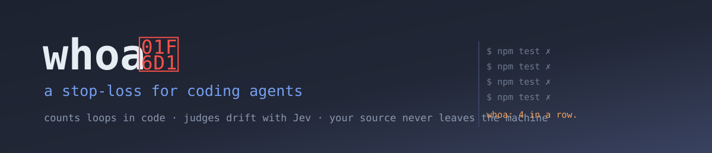

# whoa 🛑

[](https://github.com/PaulChen79/whoa/actions/workflows/ci.yml)
[](https://pkg.go.dev/github.com/PaulChen79/whoa)
[](https://goreportcard.com/report/github.com/PaulChen79/whoa)
[](LICENSE)
[](https://github.com/PaulChen79/whoa/releases)

**A stop-loss for coding agents.**

An agent that has lost the plot rarely says so. It keeps going: retrying the same failing command, editing further and further from what you asked, or quietly redefining the job into something it can finish. whoa watches the tool calls, notices, and says something before the next one.

Counting is done in code. Judgement is done by [TypeSafe's Jev](https://docs.typesafe.ai/introduction), a classifier that answers fixed questions with calibrated probabilities instead of prose — so the decision to interrupt you is a number you can threshold, log, and later prove wrong.

<!-- TODO: record assets/demo.gif + assets/demo.mp4 and replace the block below with:
     <a href="assets/demo.mp4"></a>
     See assets/README.md for what to capture. -->

```console
$ npm test -- auth      ✗ 1 failing
$ npm test -- auth      ✗ 1 failing
$ npm test -- auth      ✗ 1 failing
$ npm test -- auth      ✗ 1 failing

whoa: Bash has failed 4 times in a row. This looks like the same approach being
      retried rather than a new one. Stop and consider whether the obstacle is
      what you think it is, or say what you are stuck on instead of trying again.
```

[Install](#try-it) · [What leaves your machine](#what-leaves-your-machine) · [Parameters](#parameters) · [Read the core](internal/core/observe.go)

> [!IMPORTANT]
> **v0.** Counter-only Mode is finished and is the default. The Judge is implemented and works end to end, but **its judgement is unproven**: the release gate is 50 hand-labelled Verdicts at a false positive rate of 20% or better, and the corpus stands at **0**. Run `whoa calibrate` to see where it is. Until then, `counters` is the mode to trust.

## The three ways it goes wrong

```text
                       one tool call
                            │
        ┌───────────────────┴───────────────────┐
        │  Loop      same attempt, same result  │  counted in code
        │  Drift     no longer serves the goal  │  judged by Jev
        │  Evasion   the test moved, not the code │ judged by Jev
        └───────────────────┬───────────────────┘
                            │
          Nudge ────────────┴──────────── Halt
   a sentence in the agent's         one tool call denied,
   context before its next           with a reason; the turn
   move. It never sees the           survives, so the agent
   probability — it would            can still rescue itself
   argue with the number.            without dragging you in.
```

Loop needs no opinion, so whoa counts it and never spends a token. Drift and Evasion do, so they go to a judge — and only once a counter has already fired, never on every step.

## What leaves your machine

Nothing, in the default mode. In the other two, exactly this Digest and these five questions — no more:

```text
your goal, as you wrote it            "fix the failing auth test"
the last N tool calls                 tool · outcome · duration
  their commands, redacted            "npm test"        ← secrets stripped
  their edits, as counts              assertions -2, skips +1, test file
the counters                          Bash failed 4× in a row
```

Never your source code, your file contents, or your file paths. `whoa digest` prints the exact payload so you can read it before anyone else does.

<details>
<summary><b>Every Signal an edit can produce</b> — the complete list</summary>

`test_file` · `lines_added` · `lines_removed` · `assertions_added` · `assertions_removed` · `skip_markers_added`

Counts and one boolean. A test walks the struct and fails if a field is added without documenting it here.
</details>

<details>
<summary><b>Every Redaction rule</b> — and when whoa gives up</summary>

Removed: inline `NAME=value` assignments · values after `--token`, `--password`, `--secret`, `--api-key`, `--auth`, `--key`, `--pass`, `--credential`, `--access-token`, `--private-key` · `Authorization`, `Cookie`, `X-Api-Key`, `Proxy-Authorization` headers · `user:pass@` in URLs · `sk-`, `sk-ant-`, `ghp_`, `gho_`, `ghu_`, `ghs_`, `ghr_`, `github_pat_`, `AKIA`, `ASIA`, `xoxb-`, `AIza`, `npm_`, `glpat-`, JWTs · any opaque blob of 32+ characters.

**Degrades to `argv[0]` alone** when the end of a secret cannot be found: a heredoc, a newline, unbalanced quotes, a 256+ character token, or a `-----BEGIN` key body. A worse verdict on a few steps is the price; a leaked key is not.
</details>

## Try it

```sh
go install github.com/PaulChen79/whoa/cmd/whoa@latest
whoa install
whoa doctor
```

`whoa install` registers its hooks with every harness it finds — Claude Code in `~/.claude/settings.json`, Codex in `~/.codex/hooks.json`. It merges into what is there and leaves every other setting exactly as it was, key order included. `whoa uninstall` takes them out again. Both are idempotent.

**Codex needs one more step.** It will not run a hook it has not been told to trust, and it fails quietly rather than loudly:

```sh
codex          # then run /hooks, review whoa, and trust it
```

Run `whoa doctor` afterwards. An unregistered hook, a registered-but-untrusted one, and an administrator policy silently disabling hooks all look identical from the outside — and all three leave you believing you are protected when you are not. `doctor` tells them apart and exits non-zero when nothing is running, so you can put it in a check.

## Using the Jev judge

Counter-only Mode needs no account and sends nothing. Shadow and full mode call [Jev](https://typesafe.ai) and need a key.

**1. Get a key.** Sign up at [typesafe.ai](https://typesafe.ai) and create an API key from the dashboard.

**2. Export it.** whoa reads `WHOA_JEV_API_KEY` first, then falls back to `TYPESAFE_API_KEY`, so an existing TypeSafe setup works unchanged:

```sh
export WHOA_JEV_API_KEY=ts_...        # add to ~/.zshrc or ~/.bashrc
```

whoa never reads a key from its config file, so `~/.whoa/config.json` stays safe to commit or share.

**3. Turn a mode on.** Start with `shadow`: it records what it would have said without ever interrupting you, which is how the calibration corpus gets built.

```jsonc
// ~/.whoa/config.json
{ "mode": "shadow" }        // then "full" once you trust it
```

**4. Check it before trusting it.**

```sh
whoa digest        # the exact payload that would be sent
whoa doctor        # is any of this actually running?
```

Without a key, whoa degrades to counters and says so once per session. Set `on_missing_key` to `"error"` to be told plainly that you are unprotected instead. Degrading never makes whoa louder than the mode you chose: shadow mode without a key stays silent.

The call runs in a detached process. No tool call ever waits for it.

**Cost.** Five questions over a ~1,100 token digest, and only when a counter has already fired. At Jev's input pricing that is a small fraction of a cent per judgement, and output is free.

> [!WARNING]
> **The wire format is unverified.** This project has never held a Jev key, so the request shape follows the published description of the primitives rather than a schema anyone has exercised against the live service. `whoa digest` prints exactly what would be sent so you can check it against your own account. A mismatch degrades that step to counters; it does not break the tool.

## Harnesses

| | Claude Code | Codex |
|---|---|---|
| Observe a tool call | ✅ | ✅ |
| Distinguish success from failure | ✅ separate events | ⚠️ read from the tool's response |
| Nudge before the next call | ✅ | ✅ |
| Halt one call, keep the turn | ✅ | ✅ |
| Goal and turn boundaries | ✅ | ✅ |
| Trust step required | — | ⚠️ `/hooks` |

Codex has no failure event, so whoa reads `exit_code`, `status`, `success` or `error` out of the tool's own response. A shape it does not recognise is recorded as success, which under-counts loops rather than inventing them. Codex also wraps every command in `/bin/zsh -lc`; whoa unwraps it, so the same work reads the same on both.

Codex's `PostToolUse` can block and Claude Code's cannot. whoa deliberately does not use it: halting only at `PreToolUse` means the behaviour is identical on both, and nothing whoa does depends on a capability one harness lacks.

## Parameters

`~/.whoa/config.json`, all optional. A missing file is not an error.

| Key | Default | What it does |
|---|---|---|
| `mode` | `"counters"` | `counters` · `shadow` · `full` |
| `window` | `50` | how many recent steps the counters see |
| `trigger.repeated_failures` | `4` | same tool failing in a row |
| `trigger.repeated_tool` | `0` | same tool in a row, any outcome (0 = off) |
| `trigger.failed_steps` | `0` | failures anywhere in the window (0 = off) |
| `nudge_threshold` | `0.60` | probability at which a verdict speaks |
| `halt_threshold` | `0.88` | probability at which a verdict denies a call |
| `halt_enabled` | `true` | `false` for a nudge-only posture |
| `ineffective_nudges_before_halt` | `3` | ignored nudges before halting |
| `notify` | `true` | your one-line messages (never silences a halt) |
| `model` | `"jev-1.13.0"` | pinned, so a corpus stays comparable |
| `state_dir` | `~/.whoa` | where logs live |
| `retention_days` | `14` | logs expire; marked ones never do |
| `on_missing_key` | `"degrade"` | or `"error"` |

A test fails if a parameter exists in code but is missing from this table.

## Invariants

Not configurable, each for a reason:

- **The digest never carries file contents or paths.** A toggle here is a footgun; the right move is picking the default correctly, not delegating the choice.
- **Redaction degrades to `argv[0]`.** The fallback must not be defeatable.
- **The agent never sees the probability.** It would argue with the number. You see it, because you need it to judge `whoa wrong`.
- **Questions are always English.** Jev is weaker in CJK, and a mistranslated question is a miscalibrated one.
- **A halt never ends the turn.** A stop-loss you cannot talk out of a mistake is worse than none.
- **`progress` never participates in a verdict.** It is collected for calibration only. This one is not permanent — it lifts if the score proves itself.

## Is it any good?

Nobody knows yet, including the author. Jev's published evaluations are vendor-self-reported, with no paper, no reliability curve and no calibration error. whoa's own corpus is **0 samples**. So it ships with the means to check it rather than a claim:

```sh
whoa wrong       # the last thing whoa said was wrong
whoa calibrate   # how often has it been wrong?
```

`whoa wrong` marks the verdict and exempts that log from expiry, so the corpus outlives retention. `whoa calibrate` reports the false positive rate against the gate and exits non-zero until it is met. If the calibration claim never holds up, Counter-only Mode is the product — and it needs no account, no key and no network.

## Development

```sh
go test -race ./...
gofmt -l . && go vet ./...
go test -run Fuzz -fuzztime=60s ./internal/redact
```

Two seams carry the tests. `internal/core` is pure: raw payload plus log plus config in, decision out, no I/O. `internal/redact` is the privacy boundary, and its fuzz targets assert that no input produces a signal echoing it. Everything that touches a disk or a network lives in `cmd/whoa`.

---

[TypeSafe Jev](https://docs.typesafe.ai/introduction) · [Claude Code hooks](https://docs.claude.com/en/docs/claude-code/hooks) · [Codex hooks](https://developers.openai.com/codex/hooks) · [MIT](LICENSE)
